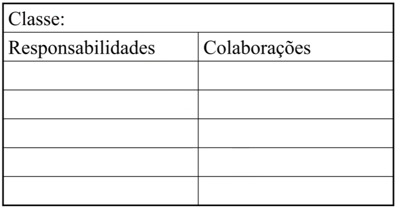

# PROGRAMAÇÃO MODULAR

Professor João Caram

caram@pucminas.br

**Regras informais:**

1. NÃO ENTRE EM PÂNICO, primeiro é entender o problema
2. NÃO VIAJE
3. **NÃO INTERESSA** QUEM FEZ/COMO FAZER

## Aula — Revisão e Nivelamento

### Entrada de dados

- `IO.readln()` **sempre retorna `String`** — independente do que o usuário digitar, o valor lido é uma string e precisa ser convertido para o tipo desejado depois.
    - Se for necessario, para transformar os dados em `int`, `double`, etc:
        
        Como `IO.readln()` sempre retorna `String`, é preciso converter o valor lido para o tipo correto antes de usar.
        
        | Para converter em | Método | Exemplo |
        | --- | --- | --- |
        | `int` | `Integer.parseInt(str)` | `int idade = Integer.parseInt("25");` |
        | `double` | `Double.parseDouble(str)` | `double nota = Double.parseDouble("9.5");` |
        | `float` | `Float.parseFloat(str)` | `float peso = Float.parseFloat("72.3");` |
        | `long` | `Long.parseLong(str)` | `long populacao = Long.parseLong("8000000000");` |
        | `boolean` | `Boolean.parseBoolean(str)` | `boolean ativo = Boolean.parseBoolean("true");` |
- **String em Java é um objeto**, não um tipo primitivo. Isso significa que possui métodos próprios.

### Métodos de String

| Método | O que faz | Quando usar |
| --- | --- | --- |
| `charAt(int posicao)` | Retorna o caractere na posição indicada | Acessar uma letra específica da string |
| `indexOf(String busca)` | Retorna o índice da primeira ocorrência, ou `-1` se não encontrar | Verificar se/onde um trecho existe na string |
| `length()` | Retorna a quantidade de caracteres | Validar se a string está vazia ou tem tamanho esperado |
| `replace(String original, String novo)` | Substitui todas as ocorrências de `original` por `novo` | Limpar ou transformar partes de uma string |
| `split(String expressao)` | Divide a string em um array usando o separador informado | Separar campos de uma linha lida com `IO.readln()` |
| `substring(int inicio, int final)` | Retorna um pedaço da string entre as posições indicadas | Extrair partes específicas de uma string |

Exemplos:

```java
String linha = "João,25,BH";
String[] partes = linha.split(","); // ["João", "25", "BH"]

String nome = "  João  ";
int tam = nome.length();             // 8 (espaços contam)
char c = nome.charAt(2);             // 'J'
String limpo = nome.replace(" ", ""); // "João"
String sub = nome.substring(2, 6);   // "João"
```

---

## Aula — Princípios da POO

### O que é uma Classe?

Uma classe **representa um conjunto de coisas** do mundo real ou do domínio do problema.

**A classe é feita para resolver um problema**

Ela é composta de dois elementos:

- **Atributos** → os dados que ela guarda (o estado)
- **Métodos** → as operações que ela sabe realizar (o comportamento)

> Uma classe tem que **responder coisas** e ter os **dados para responder essas coisas**. Atributos e métodos existem juntos por isso.
> 

### → POO segundo Alan Kay

Alan Kay, um dos criadores do paradigma, definiu a essência da POO assim:

> **"As classes vão fazer uma troca de mensagens."**
> 

Objetos não acessam diretamente os dados uns dos outros — eles se **comunicam via mensagens** (chamadas de métodos). Isso promove encapsulamento e baixo acoplamento.

### Construtor

O construtor é o método chamado no momento da criação de um objeto. Sua função principal é **garantir que o objeto nasça em um estado válido**.

- Um bom construtor **valida os dados** antes de atribuí-los.
- Criar um construtor sem validação "não serve para nada" — o objeto pode ser criado em um estado incoerente.

```java
public Aluno(String nome, int idade) {
    if (nome == null || nome.isBlank()) throw new IllegalArgumentException("Nome inválido");
    if (idade < 0) throw new IllegalArgumentException("Idade inválida");
    this.nome = nome;
    this.idade = idade;
}
```

---

## Aula — Princípios SOLID

**SOLID** é um acrônimo com 5 princípios de design de software orientado a objetos que tornam o código mais fácil de manter, estender e entender.

| Letra | Nome em inglês | Tradução |
| --- | --- | --- |
| **S** | Single Responsibility Principle | Princípio da Responsabilidade Única |
| **O** | Open/Closed Principle | Princípio do Aberto/Fechado |
| **L** | Liskov Substitution Principle | Princípio da Substituição de Liskov |
| **I** | Interface Segregation Principle | Princípio da Segregação de Interface |
| **D** | Dependency Inversion Principle | Princípio da Inversão de Dependência |

---

### S — Single Responsibility Principle — Princípio da Responsabilidade Única

> **"Uma classe deve ter apenas um motivo para mudar."**
> 

Cada classe deve ter **uma única responsabilidade**. Se ela precisa mudar por mais de um motivo, é sinal de que está fazendo coisas demais.

Ao terminar uma classe, você pode se perguntar **“O que essa classe faz?”**. Se na sua resposta tiver os conectivos **“e”** ou **“ou”** provavelmente essa classe pode fazer mais coisas do que deveria.

**Responsabilidade = motivo de mudança**

### Exemplo:

Imagine uma classe `Aluno` que, além de guardar os dados do aluno, também sabe se imprimir na tela:

❌Classe com múltiplas responsabilidades:

```java
class Aluno {
    String nome;
    double nota;

    double calcularMedia() { ... }   // faz sentido — é sobre o aluno
    void imprimirNaTela() { ... }    // problema — isso é responsabilidade de quem exibe dados
}
```

O problema: se o layout da impressão mudar (ex: o sistema passa a usar HTML em vez de texto), você precisa **mexer na classe Aluno** — mas Aluno não deveria se importar com como é exibido, só com seus próprios dados.

São dois motivos diferentes para mudar:

- Regra de negócio muda → altera `calcularMedia()`
- Interface muda → altera `imprimirNaTela()`

✅ Separado corretamente, cada classe muda por apenas um motivo:

```java
class Aluno {
    String nome;
    double nota;
    double calcularMedia() { ... }  // só sabe sobre si mesmo
}

class ExibidorDeAluno {
    void imprimirNaTela(Aluno a) { ... }  // só sabe exibir
}
```

## Aula — 11/03

### Classes não imprimem nada

Uma classe **nunca deve ter lógica de impressão** (ex: `System.out.println()`). Quem imprime é o `App.java` (o ponto de entrada do programa).

Por quê? Vai contra o princípio básico da modularidade: uma classe precisa ser **reutilizável em qualquer contexto** — terminal, interface gráfica, web. Se ela imprime direto no console, fica presa a um único contexto e não pode ser reaproveitada.

---

### Testes — JUnit

Para testar uma classe `Pedido`, cria-se um arquivo `PedidoTest.java`. Cada método de teste recebe a anotação `@Test` do JUnit.

**Todo método da classe deve ser testado.**

O nome do teste precisa ser **bem descritivo** — deve deixar claro o que está sendo testado e qual o resultado esperado.

```java
@Test
void deveCalcularValorTotalComDuasPizzas() { ... }  // claro
@Test
void teste1() { ... }  // ruim — não diz nada
```

### Padrão AAA (Arrange, Act, Assert)

Cada teste deve seguir três etapas:

| Etapa | O que faz | Exemplo |
| --- | --- | --- |
| **Arrange** (Preparar) | Cria os objetos e define os dados necessários | `Pedido p = new Pedido();` |
| **Act** (Agir) | Executa a ação que está sendo testada | `double total = p.calcularValor();` |
| **Assert** (Verificar) | Confere se o resultado foi o esperado | `assertEquals(50.0, total, 0.01);` |

### `assertEquals` com `double`

Ao comparar valores `double`, é obrigatório passar um **terceiro parâmetro: o fator de erro (delta)**. Isso porque `double` tem imprecisão de ponto flutuante.

```java
assertEquals(50.0, total, 0.01);
//           esperado, obtido, margem de erro aceita
```

---

### `static` e constantes

- **`static`** → o atributo ou método **pertence à classe**, não ao objeto. É o mesmo valor compartilhado por todas as instâncias.
- **`final`** → torna o valor **imutável** após a atribuição.
- **Constante** = `static final` + nome em **MAIÚSCULAS**.

```java
class Pizza {
    static int totalCriadas = 0;           // compartilhado entre todas as pizzas
    static final double TAXA = 0.1;        // constante — nunca muda
}
```

---

### Classe Pedido — Cartão de Responsabilidades (CRC)

O cartão CRC (*Class-Responsibility-Collaboration*) descreve o que uma classe **sabe fazer** e com quem ela **colabora** para isso.

| Responsabilidade | Colaboração |
| --- | --- |
| Adicionar Pizza | `Pizza` — recebe o objeto |
| Saber data e ID | — |
| Validar inclusão | — |
| Gerar relatório | `Pizza` — retorna a descrição |
| Calcular valor | `Pizza` — retorna o valor |
| Fechar pedido | — |

**Atributos da classe `Pedido`:**

- `data`
- `id`
- `List<Pizza> pizzas`
- `boolean aberto` (estado do pedido)

- Como fazer Cartão Responsabilidade
    
    Deve ser um cartão pequeno e objetivo
    
    Esse cartão deve ter um campo com o nome da classe, e duas listas para responsabilidades e colaborações do elemento.
    
    
    
    Conceito de classe é uma estrutura que agrupa vários membros:
    
    Atributos → “De que isso é feito?”
    
    Comportamentos → “O que isso pode fazer?”
    
    **→** A seção de responsabilidade do cartão vai listar os comportamentos esperados para uma determinada classe
    
    - Existem dois tipos de responsabilidade:
        
        → A classe deve guardar e receber informações
        
        → A classe deve ser capaz de fazer algo especifico 
        
    
    **→** A seção de colaborações define como os objetos interagem entre si, essa interação é feita em dois momentos:
    
    - Quando são necessários múltiplos objetos para alcançar um objetivo em comum
    - Quando a responsabilidade de um objeto precisa da informação que outro objeto tem a responsabilidade. Ou seja, possui a responsabilidade mas não a informação (tem que pedir a outro objeto)
    
    **→ Na hora de fazer um cartão, marcar os SUBSTANTIVOS provavelmente serão as classes. Marcar também os VERBOS eles provavelmente serão as atribuições/responsabilidades da classe**
    
    → A colaboração funciona na falta de informação, se a classe precisa de algum dado ou ela pede algum verbo.
    
    "Eu, classe **[MinhaClasse]**, consigo realizar a ação **[Verbo]** usando EXCLUSIVAMENTE as variáveis primitivas (int, double, String) que criei aqui dentro?"
    
    → Se a resposta for **sim** a coluna de colaboração fica vazia
    
    → Se a resposta for **não** a coluna de colaboração deve ser previamente preenchida
    
    - Exemplo: Classe livro consegue realizar a ação de calcular a estimativa do tempo gasto para se ler o livro exclusivamente com as variáveis aqui dentro?
    
    
    

---

### Listas — `ArrayList` vs `LinkedList`

## O que são Listas?

**Lista** é uma estrutura de dados que armazena uma coleção ordenada de elementos que **cresce dinamicamente** conforme itens são adicionados. Diferente de arrays tradicionais, você não precisa definir o tamanho previamente.

---

## ArrayList vs LinkedList

### 📊 Comparação Rápida

| Característica | ArrayList | LinkedList |
| --- | --- | --- |
| **Estrutura interna** | Array dinâmico | Nós encadeados |
| **Melhor para** | Acesso por índice, tamanho previsível | Inserções/remoções frequentes |
| **Acesso por índice** | ⚡ Rápido O(1) | 🐌 Lento O(n) |
| **Inserção no meio** | 🐌 Lento O(n) | ⚡ Rápido O(1)* |
| **Uso de memória** | Menor overhead | Maior overhead (ponteiros) |
| **Iteração** | Mais rápida | Mais lenta |
- Desde que você já tenha a referência do nó

---

## 1️⃣ ArrayList

### 🔍 Como Funciona

ArrayList usa um **array interno** que é redimensionado automaticamente quando necessário. Quando o array fica cheio, um novo array maior é criado (geralmente 50% maior) e todos os elementos são copiados.

### 📝 Como Criar

```java
import java.util.ArrayList;
import java.util.List;

// Forma 1: Declaração básica
ArrayList<String> nomes = new ArrayList<>();

// Forma 2: Usando interface List (RECOMENDADO)
List<String> frutas = new ArrayList<>();

// Forma 3: Com capacidade inicial (otimização)
List<Integer> numeros = new ArrayList<>(100);

// Forma 4: A partir de outra coleção
List<String> copia = new ArrayList<>(frutas);

// Forma 5: Com valores iniciais (Java 9+)
List<String> cores = new ArrayList<>(List.of("Vermelho", "Azul", "Verde"));
```

### ⚙️ Operações Principais

```java
List<String> animais = new ArrayList<>();

// ➕ ADICIONAR
animais.add("Gato");                    // Adiciona no final
animais.add("Cachorro");
animais.add(0, "Papagaio");            // Adiciona na posição 0
// Resultado: [Papagaio, Gato, Cachorro]

// 🔍 ACESSAR
String primeiro = animais.get(0);       // "Papagaio"
String ultimo = animais.get(animais.size() - 1); // "Cachorro"

// ✏️ MODIFICAR
animais.set(1, "Leão");                // Substitui "Gato" por "Leão"
// Resultado: [Papagaio, Leão, Cachorro]

// ❌ REMOVER
animais.remove(0);                      // Remove por índice
animais.remove("Cachorro");             // Remove por objeto
// Resultado: [Leão]

// 📏 TAMANHO
int quantidade = animais.size();

// ✅ VERIFICAR
boolean temLeao = animais.contains("Leão");
boolean vazia = animais.isEmpty();

// 🧹 LIMPAR
animais.clear();                        // Remove todos
```

### 🎯 Exemplo Prático

```java
List<String> tarefas = new ArrayList<>();
tarefas.add("Estudar Java");
tarefas.add("Fazer exercícios");
tarefas.add("Revisar código");

// Adicionar no início
tarefas.add(0, "Bug urgente");

// Percorrer
for (String tarefa : tarefas) {
    System.out.println(tarefa);
}

// Buscar
if (tarefas.contains("Revisar código")) {
    System.out.println("Encontrada!");
}
```

---

## 2️⃣ LinkedList

### 🔍 Como Funciona

LinkedList usa uma estrutura de **nós encadeados**. Cada elemento (nó) contém:

- O valor armazenado
- Referência para o próximo nó
- Referência para o nó anterior (lista duplamente encadeada)

`[Nó 1] ↔ [Nó 2] ↔ [Nó 3] ↔ [Nó 4]`

### 📝 Como Criar

```java
import java.util.LinkedList;
import java.util.List;

// Forma 1: Declaração básica
LinkedList<String> lista = new LinkedList<>();

// Forma 2: Usando interface List (RECOMENDADO)
List<Integer> numeros = new LinkedList<>();

// Forma 3: A partir de outra coleção
List<String> copia = new LinkedList<>(lista);
```

### ⚙️ Operações Principais

LinkedList tem **todas as operações do ArrayList** mais métodos específicos para trabalhar como fila/pilha:

```java
LinkedList<String> fila = new LinkedList<>();

// ➕ ADICIONAR
fila.add("Primeiro");           // Adiciona no final (igual ArrayList)
fila.addFirst("Início");        // ⭐ Adiciona no início (RÁPIDO)
fila.addLast("Fim");            // Adiciona no final

// 🔍 ACESSAR
String primeiro = fila.getFirst();  // ⭐ Pega o primeiro
String ultimo = fila.getLast();     // ⭐ Pega o último
String qualquer = fila.get(1);      // Por índice (LENTO)

// ❌ REMOVER
String removidoInicio = fila.removeFirst();  // ⭐ Remove do início (RÁPIDO)
String removidoFim = fila.removeLast();      // ⭐ Remove do fim (RÁPIDO)

// 🔄 OPERAÇÕES DE FILA (Queue)
fila.offer("Novo item");        // Adiciona (como add)
String proximo = fila.poll();   // Remove e retorna o primeiro
String espiar = fila.peek();    // Apenas visualiza o primeiro (não remove)
```

### 🎯 Exemplo Prático: Fila de Atendimento

```java
LinkedList<String> fila = new LinkedList<>();

// Clientes chegando
fila.add("João");
fila.add("Maria");
fila.add("Pedro");

// Cliente VIP (prioridade)
fila.addFirst("Carlos (VIP)");

// Atendendo
while (!fila.isEmpty()) {
    String cliente = fila.removeFirst();
    System.out.println("Atendendo: " + cliente);
}
```

---

## 🔄 For-Each: Percorrendo Listas

```java
List<String> pizzas = new ArrayList<>();
pizzas.add("Calabresa");
pizzas.add("Mussarela");
pizzas.add("Portuguesa");

// For-Each (forma simplificada)
for (String pizza : pizzas) {
    System.out.println(pizza);
}

// For tradicional (quando precisa do índice)
for (int i = 0; i < pizzas.size(); i++) {
    System.out.println((i+1) + ". " + pizzas.get(i));
}
```

- **`String pizza`**: É a criação de uma variável temporária. Imagine que é uma "mão" que pega um item da lista por vez. Como sua lista é de Strings, essa variável precisa ser do tipo `String`.
- **`:`**: Leia como **"dentro de"** ou **"em"**.
- **`pizzas`**: É a sua coleção completa (o balde com todos os itens).

### 2. Como ele funciona (Passo a Passo)

1. O Java olha para a lista `pizzas`.
2. Ele pega o primeiro item ("Calabresa") e o coloca dentro da variável `pizza`.
3. Ele executa o código dentro das chaves `{ }`.
4. Ele volta na lista, pega o segundo item ("Mussarela"), substitui o valor na variável `pizza` e repete o processo até chegar ao fim.

---

## 🤔 Quando Usar Cada Uma?

### ✅ Use **ArrayList** quando:

- Você acessa elementos por índice frequentemente
- Faz mais leituras do que inserções/remoções
- Sabe aproximadamente o tamanho da lista
- Quer economizar memória
- **Caso de uso:** Lista de produtos, histórico de navegação, resultados de busca

### ✅ Use **LinkedList** quando:

- Faz muitas inserções/remoções no início/meio da lista
- Implementa filas (Queue) ou pilhas (Stack)
- Não precisa de acesso aleatório por índice
- **Caso de uso:** Fila de atendimento, histórico de comandos (undo/redo), playlist de músicas

---

## 💡 Dicas e Boas Práticas

### 1️⃣ Use a interface List

```java
// ✅ BOM
List<String> nomes = new ArrayList<>();

// ❌ EVITE
ArrayList<String> nomes = new ArrayList<>();
```

### 2️⃣ Defina capacidade inicial se souber o tamanho

```java
List<String> dados = new ArrayList<>(1000);
```

### 3️⃣ Cuidado ao remover durante iteração

```java
// ❌ ERRO
for (String item : lista) {
    lista.remove(item); // ConcurrentModificationException
}

// ✅ CORRETO
lista.removeIf(item -> item.equals("remover"));
```

## 📚 Resumo

| Operação | ArrayList | LinkedList | Quando Usar |
| --- | --- | --- | --- |
| `add(elemento)` | O(1) amortizado | O(1) | Adicionar no final |
| `add(index, elemento)` | O(n) | O(n) | Inserir no meio |
| `addFirst(elemento)` | - | O(1) | LinkedList para início |
| `get(index)` | O(1) | O(n) | ArrayList para acesso |
| `remove(index)` | O(n) | O(n) | Ambas similares |
| `removeFirst()` | - | O(1) | LinkedList para fila |

**→ Regra de ouro: Na dúvida, use ArrayList. É a escolha padrão em 90% dos casos! 🎯**

### `for-each`

Forma simplificada de percorrer uma lista sem precisar de índice:

```java
for (Pizza p : pizzas) {
    System.out.println(p.getDescricao());
}
```

### Objetos dentro de classes — inicializar no construtor

Quando uma classe usa outra como atributo, o objeto deve ser **criado dentro do construtor**, não apenas declarado:

```java
class Pedido {
    List<Pizza> pizzas;

    public Pedido() {
        pizzas = new ArrayList<>();  // inicializa aqui, senão é null
    }
}
```

---

### Relacionamentos entre classes (UML)

Descrevem como as classes se conectam. O losango fica **do lado de quem controla/possui**.

| Tipo | Símbolo | Palavra-chave | Quando usar |
| --- | --- | --- | --- |
| **Contenção** (*Composition*) | Losango cheio ◆ | "Contém" | O elemento não existe sem o conjunto. Ex: `Pedido` contém `Pizza` — se o pedido some, as pizzas dele também |
| **Agregação** (*Aggregation*) | Losango vazio ◇ | "Tem" | O elemento pode existir independentemente. Ex: `Turma` tem `Aluno` — o aluno existe mesmo sem a turma |
| **Associação** (*Association*) | Seta simples → | "Usa" | Uma classe usa outra, sem posse. Ex: `Pedido` usa `Cliente` para consulta |

**→ Contenção**: Uma das classes depende da outra para existir. Em um jogo a classe `Round` não consegue existir fora da classe `Partida` . O diagrama UML teria um losango cheio encostado na classe `Partida` .

**→ Agregação**: São classes que não dependem uma da outra para existir. Em uma academia a classe `Academia` pode deixar de existir que a classe `Instrutor` vai continuar existindo. O diagrama UML teria um losango vazio encostado na classe `Academia` por ser a classe que possui/tem um instrutor trabalhando nela.

**→ Associação:** Uma classe usa a outra sem nenhuma posse. Basicamente uma classe busca uma informação em outra. A classe `Instrutor` busca informações para um treino do cliente na classe `Equipamento` . No diagrama UML é apenas uma seta simples apontando para quem ele está usando.

## Aula — 15/04 (Pós 1ª Prova)

### Cuidado com `boolean`

Use `boolean` **apenas quando a resposta for estritamente sim/não, verdadeiro/falso**. Quando um atributo representa um *estado* que pode ter mais de dois valores possíveis (ex: pedido aberto, fechado, cancelado, em entrega), `boolean` é a escolha errada — use um enumerador.

```java
// Ruim — o que significa false? Fechado? Cancelado?
boolean aberto;

// Melhor
EstadoPedido estado; // ABERTO, FECHADO, CANCELADO, EM_ENTREGA
```

### O — Open/Closed Principle — Princípio do Aberto/Fechado

> **"Uma classe deve estar aberta para extensão, mas fechada para modificação."**
> 

Quando um requisito novo chega, a pergunta é: **dá para adicionar esse comportamento sem mexer no que já existe?**

- Se sim → pode entrar na classe ou ser adicionado via extensão (herança, novo método).
- Se não, ou se violar a responsabilidade única da classe → cria-se uma nova classe.

O objetivo é evitar que uma mudança quebre algo que já funcionava.

### Por que evitar "tipo" como parâmetro

Passar um tipo primitivo onde deveria haver um conceito obriga o usuário a saber detalhes internos que não são problema dele.

```java
// Ruim — o usuário precisa saber que 0 = Margherita, 1 = Calabresa...
pedido.adicionarPizza(1);

// Bom — o usuário usa um nome que faz sentido
pedido.adicionarPizza(TipoPizza.CALABRESA);
```

> *"Qual o número do índice do array para eu fazer meu pedido?"* — se o usuário precisa saber isso, o design está errado.
> 

### Enumeradores (`enum`)

Um `enum` é um tipo especial que define um **conjunto fixo de valores nomeados**. Em vez de usar números ou strings soltos, você cria um tipo próprio com opções válidas e conhecidas.

**Quando usar:**

- Quando os valores possíveis são **fixos e conhecidos** (ex: dias da semana, estados de um pedido, tipos de pizza)
- Quando o atributo tem **valores restritos** — nem todo `int` ou `String` seria válido
- Sempre que for usar uma constante, avalie se não deveria ser um `enum`

**Vantagens:**

- **Autovalidado** — o compilador rejeita qualquer valor fora do conjunto. Não tem como passar `TipoPizza.FRANGO_COM_CATUPIRY` se não existir no enum.
- **Legível** — o código fala por si mesmo, sem números mágicos.

```java
// Definição
public enum TipoPizza {
    MARGHERITA, CALABRESA, PORTUGUESA, QUATRO_QUEIJOS;
}

// Uso
TipoPizza tipo = TipoPizza.CALABRESA;
```

Os valores do enum **podem ter atributos próprios** (ex: preço, descrição) — não é obrigatório, mas é possível:

```java
public enum TipoPizza {
    MARGHERITA(25.0), 
    CALABRESA(28.0), 
    PORTUGUESA(30.0);

    private final double preco; //Armazena os valores dos tipos de pizza

    TipoPizza(double preco) { 
	    this.preco = preco; 
    }

    public double getPreco() { 
	    return preco; 
    }
}
```

**Notação UML:** escrever `<<enum>>` acima do nome, e prefixar o nome da classe com a letra **E** maiúscula.

```
<<enum>>
ETipoPizza
----------
MARGHERITA
CALABRESA
PORTUGUESA
```

---

## Aula — 20/04

### Herança e modificadores de acesso

Herança é o mecanismo pelo qual uma **classe filha (especialista)** herda atributos e métodos da **classe mãe (genérica)**. A filha representa um caso mais específico da mãe.

```java
class Animal {
    String nome;
    void respirar() { ... }
}

class Cachorro extends Animal {
    void latir() { ... }  // comportamento específico
}
```

### Modificadores e o que a filha herda

| Modificador | Visível na filha? | Visível fora do pacote? |
| --- | --- | --- |
| `public` | ✅ | ✅ |
| `protected` | ✅ | ❌ |
| `private` | ❌ | ❌ |
- **`protected`** → acessível pela própria classe **e por todas as classes filhas**, mas não por qualquer outra classe de fora. Útil para atributos que a filha precisa manipular diretamente.
- Tudo que é `public` ou `protected` é herdado automaticamente pela classe filha.
- Atributos `private` **não são herdados** — a filha não os enxerga diretamente. Para acessá-los, usa os métodos `get`/`set` da mãe.

### Sobrescrita de métodos (*Override*)

Quando a classe filha precisa de um comportamento **diferente** do que a mãe define para o mesmo método, ela o sobrescreve com `@Override`:

```java
class Animal {
    void fazerSom() { System.out.println("..."); }
}

class Cachorro extends Animal {
    @Override
    void fazerSom() { System.out.println("Au!"); }
}
```

> Métodos "repetidos" (mesmo nome na mãe e na filha) surgem da necessidade de **alterar uma regra** para aquele caso específico. Se o método da mãe serve, não é preciso sobrescrever.
> 

### Construtor da classe filha — `super()`

Para que o construtor da classe filha seja seguro, ele **deve chamar o construtor da classe mãe** usando `super()`. Isso garante que o estado herdado também seja inicializado e validado corretamente.

Se você não chamar `super()` explicitamente, o Java tenta chamar um construtor sem parâmetros da mãe automaticamente — o que falha se a mãe não tiver um.

```java
class Animal {
    String nome;

    public Animal(String nome) {
        if (nome == null || nome.isBlank()) throw new IllegalArgumentException("Nome inválido");
        this.nome = nome;
    }
}

class Cachorro extends Animal {
    String raca;

    public Cachorro(String nome, String raca) {
        super(nome);   // chama o construtor da mãe — obrigatório e deve ser a primeira linha
        this.raca = raca;
    }
}
```

> `super()` sempre deve ser a **primeira linha** do construtor da filha.
> 

---

## Aula — 27/04

### Por que chamar `super()` no construtor da filha?

Ao instanciar um objeto da classe filha, os atributos herdados da classe mãe também precisam ser inicializados — e, principalmente, **validados**. Sem `super()`, a lógica de validação da mãe é ignorada, e o objeto pode ser criado em um estado inválido.

O `super()` é para executar a logica do construtor da classe mãe.

```java
class Animal {
    String nome;

    public Animal(String nome) {
        if (nome == null || nome.isBlank()) throw new IllegalArgumentException("Nome inválido");
        this.nome = nome;
    }
}

class Cachorro extends Animal {
    String raca;

    public Cachorro(String nome, String raca) {
        super(nome);   // valida e inicializa o atributo da mãe
        this.raca = raca;
    }
}
```

Se você tentar criar `new Cachorro(null, "Labrador")`, a exceção vai ser lançada dentro do construtor de `Animal` — exatamente o comportamento esperado. Sem o `super()`, esse erro passaria em branco.

> `super()` deve ser **sempre a primeira linha** do construtor da filha. O Java não permite colocar nenhuma instrução antes dele.
> 

**Sobre acesso por referência:** os atributos `protected` da mãe são compartilhados com a filha no mesmo espaço de memória. Quando a filha acessa `this.nome`, ela está lendo/escrevendo no mesmo campo que foi alocado pelo construtor da mãe. Não existe uma "cópia" do atributo — é o mesmo.

### Override — quando usar?

`@Override` deve ser usado quando a classe filha precisa **alterar o comportamento** de um método herdado. Para isso, o método deve ter **exatamente o mesmo nome, parâmetros e tipo de retorno** que o da mãe.

```java
class Animal {
    void fazerSom() { System.out.println("..."); }
}

class Cachorro extends Animal {
    @Override
    void fazerSom() { System.out.println("Au!"); }
}

class Gato extends Animal {
    @Override
    void fazerSom() { System.out.println("Miau!"); }
}
```

A anotação `@Override` não é obrigatória, mas é uma boa prática: se você errar o nome do método, o compilador avisa que não está sobrescrevendo nada.

> **Regra prática:** se existe uma regra de negócio que precisa ser diferente para a classe filha, use `@Override`. Se o comportamento da mãe já serve, não sobrescreva — herança já garante o reaproveitamento.
> 

### Princípio da Substituição de Liskov

> **"Se S é subtipo de T, então objetos do tipo T podem ser substituídos por objetos do tipo S sem quebrar o programa."**
> 

Em linguagem direta: qualquer lugar do código que espera um `Animal` deve funcionar igualmente bem recebendo um `Cachorro` ou um `Gato`. A classe filha **não pode enfraquecer o contrato** da mãe — ela pode especializar, mas não quebrar.

**Exemplo de violação de Liskov:**

```java
class Retangulo {
    void setLargura(int l) { this.largura = l; }
    void setAltura(int a) { this.altura = a; }
}

class Quadrado extends Retangulo {
    @Override
    void setLargura(int l) {
        this.largura = l;
        this.altura = l;  // força os dois iguais — quebra o contrato do Retangulo!
    }
}
```

Aqui, `Quadrado` viola Liskov porque muda o comportamento de uma forma que surpreende quem usa `Retangulo`. Quem define `largura = 5` não espera que `altura` mude junto.

> O `@Override` é o mecanismo que garante Liskov na prática: a filha **redefine** o comportamento, mas mantém o **contrato** do método.
> 

### Polimorfismo — criando objetos pelo tipo da mãe

> Polimorfismo é a capacidade de um objeto ser referenciado de varias formas
> 
- Basicamente, o mesmo comando vai retornar resultados diferentes

É preferível declarar variáveis pelo tipo da **classe mãe** e instanciar com a **classe filha**. Isso permite que o mesmo código funcione com qualquer subclasse, sem precisar saber qual é.

```java
Animal a1 = new Cachorro("Rex", "Labrador");
Animal a2 = new Gato("Mimi");

a1.fazerSom();  // "Au!"
a2.fazerSom();  // "Miau!"
```

Você pode, por exemplo, colocar vários animais em uma lista e chamar `fazerSom()` em todos sem saber o tipo específico de cada um — o Java resolve isso em tempo de execução. Isso é o **dispatch dinâmico**.

```java
List<Animal> animais = new ArrayList<>();
animais.add(new Cachorro("Rex", "Labrador"));
animais.add(new Gato("Mimi"));

for (Animal a : animais) {
    a.fazerSom();  // cada um executa o seu método sobrescrito
}
```

> ⚠️ **Nunca usar `getClass()`** para comparar tipos em situações assim — use `instanceof` ou polimorfismo diretamente. `getClass()` quebra o princípio de Liskov porque trata subclasses como tipos diferentes quando deveriam ser intercambiáveis.
> 

---

## Aula — 29/04

### A classe `Object`

Toda classe em Java herda automaticamente da classe `Object` — mesmo sem declarar `extends`. Ela está no topo da hierarquia de herança do Java e fornece métodos utilitários disponíveis em **qualquer objeto**.

`Object
  └── Animal
        └── Cachorro`

Os três principais métodos herdados:

| Método | O que faz |
| --- | --- |
| `boolean equals(Object obj)` | Compara se dois objetos são iguais |
| `int hashCode()` | Retorna um identificador numérico único do objeto |
| `String toString()` | Representa os dados do objeto em forma de texto |

### `equals(Object obj)`

O comportamento padrão de `Object.equals` compara **referências de memória** — ou seja, retorna `true` só se os dois objetos forem exatamente o mesmo na memória (mesma instância). Para comparar pelo **conteúdo dos atributos**, é obrigatório sobrescrever.

```java
Cachorro c1 = new Cachorro("Rex", "Labrador");
Cachorro c2 = new Cachorro("Rex", "Labrador");

System.out.println(c1 == c2);          // false — objetos diferentes na memória
System.out.println(c1.equals(c2));     // false por padrão (sem override)
```

Sobrescrevendo para comparar pelo conteúdo:

```java
@Override
public boolean equals(Object obj) {
    if (this == obj) return true;                    // mesmo objeto na memória
    if (!(obj instanceof Cachorro)) return false;    // tipo diferente
    Cachorro outro = (Cachorro) obj;
    return this.nome.equals(outro.nome) && this.raca.equals(outro.raca);
}
```

### `hashCode()`

Funciona como uma **impressão digital numérica** do objeto. É usado internamente por estruturas como `HashMap` e `HashSet` para organizar e localizar objetos de forma eficiente — ao invés de comparar todos os elementos um a um, o Java usa o hashCode para ir direto ao "balde" onde o objeto deveria estar.

`HashSet: [ balde 0 ] [ balde 1 ] [ balde 2 ] ...
                           ↑
                    Cachorro "Rex" está aqui — hashCode definiu isso`

> **Regra do Java:** se dois objetos são iguais pelo `equals`, **obrigatoriamente** devem ter o mesmo `hashCode`. Caso contrário, o comportamento de `HashMap`/`HashSet` fica imprevisível.
> 

Por isso, sempre que sobrescrever `equals`, sobrescreva `hashCode` junto:

```java
@Override
public int hashCode() {
    return Objects.hash(nome, raca);  // gera um hash baseado nos atributos
}
```

### `toString()`

Converte os dados de um objeto em uma `String` legível. Sem sobrescrever, o Java retorna algo como `Cachorro@1b6d3586` — o nome da classe mais o endereço de memória, que não tem utilidade nenhuma para depuração.

```java
@Override
public String toString() {
    return "Cachorro{nome='" + nome + "', raca='" + raca + "'}";
}

// Agora:
System.out.println(c1);  // Cachorro{nome='Rex', raca='Labrador'}
```

O `toString()` é chamado automaticamente pelo Java sempre que você usa um objeto em concatenação de `String` ou no `System.out.println`.

> `String` em Java é um **objeto** (instância da classe `String`), não um tipo primitivo como `int` ou `boolean`. Por isso ela tem métodos: `.length()`, `.equals()`, `.isBlank()`, etc.
> 

---

## Aula — 04/05

### Atributos privados e métodos públicos/protegidos

O encapsulamento garante que atributos `private` não sejam acessados diretamente de fora da classe. Quando um método público ou protegido acessa esse atributo internamente, ele serve como um **ponto de controle**: você pode validar, formatar ou restringir o que entra e sai.

```java
class ContaBancaria {
    private double saldo;  // ninguém acessa direto

    public double getSaldo() {
        return saldo;  // acesso controlado — só leitura
    }

    public void depositar(double valor) {
        if (valor <= 0) throw new IllegalArgumentException("Valor inválido");
        this.saldo += valor;  // modificação controlada — com validação
    }
}
```

Isso garante que `saldo` nunca fique negativo por acidente, por exemplo.

### `toString()` — lembrete

Sempre colocar `@Override` ao sobrescrever `toString()`, pois ele é um método **herdado de `Object`**. Sem `@Override`, se você errar a assinatura, o Java não avisa e continua usando o `toString` padrão (inútil).

### Classes e Métodos Abstratos

O conceito central é **abstração**: uma classe abstrata representa uma *ideia*, um contrato, não um objeto que faz sentido existir sozinho. Não faz sentido instanciar um `Animal` genérico — faz sentido instanciar um `Cachorro` ou um `Gato`.

java

```java
public abstract class Forma {
    public abstract double area();     // ideia: toda forma tem uma área
    public abstract double perimetro();

    public void exibir() {             // método concreto — pode existir na abstrata
        System.out.println("Área: " + area());
    }
}

public class Circulo extends Forma {
    private double raio;

    public Circulo(double raio) { this.raio = raio; }

    @Override
    public double area() { return Math.PI * raio * raio; }

    @Override
    public double perimetro() { return 2 * Math.PI * raio; }
}
```

Regras importantes:

- Uma classe com **qualquer método abstrato** deve ser declarada `abstract`
- **Não pode** ser instanciada: `new Forma()` causa erro de compilação
- A subclasse **é obrigada** a implementar todos os métodos abstratos — ou ela mesma vira `abstract`
- A classe abstrata **pode ter** métodos concretos (com implementação) — e esses são herdados normalmente

### `final` — bloqueando herança e sobrescrita

| Uso | Efeito |
| --- | --- |
| `método final` | Não pode ser sobrescrito por nenhuma subclasse |
| `classe final` | Não pode ser herdada — não pode ter filhas |
| `variável final` | Vira constante — não pode ser reatribuída |

```java
public final class String { ... }       // String do Java é final — não pode herdar dela
public final double PI = 3.14159;       // constante
public final void validar() { ... }     // método que nenhuma filha pode mudar
```

> `final` é a garantia de que um comportamento **não será alterado** por nenhuma subclasse futura. Útil quando a lógica é crítica e não deve variar.
> 

---

## Aula — 06/05

### SOLID — Princípio Aberto/Fechado (Open/Closed)

> **"Um código que já funciona não deve ser modificado — apenas estendido."**
> 

| Conceito | Significado |
| --- | --- |
| **Open** (Aberto) | Aberto para extensão — novas funcionalidades podem ser adicionadas |
| **Closed** (Fechado) | Fechado para modificação — o código existente e testado não é alterado |

**Por que isso importa?** Toda vez que você modifica um código que já funciona, corre o risco de quebrar algo que estava certo. O princípio Open/Closed diz que novos comportamentos devem ser adicionados criando novas classes, não editando as antigas.

**Exemplo ruim — violando Open/Closed:**

```java
class Notificador {
    void notificar(String tipo, String msg) {
        if (tipo.equals("email")) enviarEmail(msg);
        else if (tipo.equals("sms")) enviarSMS(msg);
        // toda vez que surgir um novo tipo, tenho que criar um novo else if — PERIGOSO
    }
}
```

**Exemplo correto — seguindo Open/Closed:**

```java
abstract class Notificador {
    abstract void notificar(String msg);
}

class NotificadorEmail extends Notificador {
    @Override void notificar(String msg) { enviarEmail(msg); }
}

class NotificadorSMS extends Notificador {
    @Override void notificar(String msg) { enviarSMS(msg); }
}

// Novo tipo? Cria uma nova classe. Não toca nas outras.
class NotificadorWhatsApp extends Notificador {
    @Override void notificar(String msg) { enviarWhatsApp(msg); }
}
```

> Herança + polimorfismo são os mecanismos que tornam Open/Closed possível.
> 

---

## Aula — 11/05

### Programação Defensiva

> **Ideia central:** problemas inevitavelmente acontecerão. O código deve estar preparado para lidar com eles.
> 

Ao invés de assumir que tudo vai funcionar, o código antecipa falhas e define explicitamente o que fazer em cada uma. Isso evita que um erro em um ponto se propague silenciosamente e cause um problema difícil de rastrear mais adiante.

### Programação por Contrato

As interfaces dos componentes devem ser **especificadas formalmente**, deixando claro:

- **Pré-condições:** o que o método *exige* para funcionar corretamente (ex: o parâmetro não pode ser nulo)
- **Pós-condições:** o que o método *garante* após executar (ex: o saldo nunca fica negativo)
- **Invariantes:** condições que sempre devem ser verdadeiras para o objeto (ex: `nome` nunca é vazio)

Se o contrato for violado, uma **exceção deve ser lançada** — o erro nunca deve passar em silêncio.

### Exceções — tratamento de erros

Exceções são o mecanismo do Java para sinalizar e tratar situações inesperadas: arquivo não encontrado, valor inválido, falha de rede, divisão por zero, etc.

```java
try {
    abrirArquivo("dados.txt");
    lerDados();
} catch (FileNotFoundException e) {
    System.out.println("Arquivo não encontrado: " + e.getMessage());
} catch (IOException e) {
    System.out.println("Erro de leitura: " + e.getMessage());
} finally {
    fecharArquivo();  // executado sempre, com ou sem erro
}
```

| Bloco | Quando executa |
| --- | --- |
| `try` | Sempre — é onde fica o código que pode falhar |
| `catch` | Só se o tipo de exceção corresponder ao que foi lançado |
| `finally` | **Sempre**, independente de ter ocorrido erro ou não |

**Hierarquia de exceções no Java:**

`Throwable
  ├── Error          → erros graves da JVM (não trate — ex: OutOfMemoryError)
  └── Exception
        ├── RuntimeException    → erros de programação (NullPointer, IndexOutOfBounds)
        └── Checked Exceptions  → erros previsíveis que o Java obriga a tratar (IOException, FileNotFoundException)`

- **Checked exceptions** → o compilador obriga a tratar com `try/catch` ou declarar com `throws`
- **Unchecked exceptions (RuntimeException)** → não são obrigatórias, mas podem ser capturadas

> **Regra de ouro:** nunca deixe um `catch` vazio. Se você captura uma exceção e não faz nada, o erro desaparece sem aviso — e você vai gastar horas tentando entender por que o programa não funciona.
> 

```java
// ❌ Nunca faça isso
catch (IOException e) { }

// ✅ Sempre trate ou pelo menos registre
catch (IOException e) {
    System.out.println("Erro: " + e.getMessage());
}
```

---

## Aula 13/05

Aula sobre excessoes

trhow new Exception, NullPoiterExcepition, IllegallStateException

uso do else e codigo repetido

### `LocalDate` e `LocalDateTime`

- A data em java é armazenada dessa forma: YYYY-MM-DD

Significa que é não é no padrao brasileiro.

```java
LocalDate localDate = LocalDate.now();
```

No exemplo, o método `now()` da classe `LocalDate` vai retornar a data do momento em que o sistema está. Por exemplo: `2026-05-16`

- O `LocalDateTime` funciona de forma extremamente parecida com o local date, com a diferença que armazena as horas, minutos e segundos (e nanosegundos):

```java
LocalDateTime local = LocalDateTime.now();
```

---

## Aula 20/05 — Interfaces

### O que é uma Interface?

Quando você implementa uma interface em um sistema, você está basicamente dizendo: **"Estou de acordo com aquele contrato"**.

Uma interface **define um contrato** que a classe deve cumprir. Toda classe que implementa uma interface **promete** que vai fornecer as implementações de todos os métodos definidos naquela interface.

**Analogia prática:**

Um contrato real estabelece regras que ambas as partes devem seguir. Uma interface Java funciona da mesma forma — ela estabelece um acordo entre o sistema e a classe sobre quais métodos devem existir.

### Exemplo Prático: Sistema de Pagamento

Imagine que você está criando um sistema de e-commerce que precisa oferecer múltiplas formas de pagamento.

**Problema sem Interface:**

```java
// Classe para Cartão
class PagamentoCartao {
    public void processar(double valor) {
        System.out.println("Processando cartão de crédito: " + valor);
        // ... lógica específica do cartão
    }
}

// Classe para Boleto
class PagamentoBoleto {
    public void processar(double valor) {
        System.out.println("Processando boleto: " + valor);
        // ... lógica específica do boleto
    }
}

// Classe para PIX
class PagamentoPix {
    public void processar(double valor) {
        System.out.println("Processando PIX: " + valor);
        // ... lógica específica do PIX
    }
}
```

**Problema:** Cada classe de pagamento tem seu próprio nome e método, mas fazem a mesma coisa. Quando você quer processar um pagamento, não sabe qual classe usar.

**Solução com Interface:**

```java
// Define o contrato
interface MetodoPagamento {
    void processar(double valor);
    boolean validar();
}

// Implementações concretas
class PagamentoCartao implements MetodoPagamento {
    private String numeroCartao;
    
    public PagamentoCartao(String numeroCartao) {
        this.numeroCartao = numeroCartao;
    }
    
    @Override
    public void processar(double valor) {
        System.out.println("Processando cartão: " + valor);
        // Lógica específica do cartão
    }
    
    @Override
    public boolean validar() {
        return numeroCartao.length() == 16;
    }
}

class PagamentoBoleto implements MetodoPagamento {
    @Override
    public void processar(double valor) {
        System.out.println("Processando boleto: " + valor);
        // Lógica específica do boleto
    }
    
    @Override
    public boolean validar() {
        return true;  // Boleto sempre é válido
    }
}

class PagamentoPix implements MetodoPagamento {
    private String chave;
    
    public PagamentoPix(String chave) {
        this.chave = chave;
    }
    
    @Override
    public void processar(double valor) {
        System.out.println("Processando PIX para " + chave + ": " + valor);
        // Lógica específica do PIX
    }
    
    @Override
    public boolean validar() {
        return chave != null && !chave.isEmpty();
    }
}
```

**Como usar:**

```java
class Pedido {
    private MetodoPagamento metodo;
    
    public Pedido(MetodoPagamento metodo) {
        this.metodo = metodo;  // Aceita qualquer implementação
    }
    
    public void finalizarCompra(double valor) {
        if (metodo.validar()) {
            metodo.processar(valor);
            System.out.println("Pagamento realizado com sucesso!");
        } else {
            System.out.println("Método de pagamento inválido!");
        }
    }
}

// Na prática:
Pedido pedido1 = new Pedido(new PagamentoCartao("1234567890123456"));
pedido1.finalizarCompra(100.0);

Pedido pedido2 = new Pedido(new PagamentoPix("sua@chave.pix"));
pedido2.finalizarCompra(100.0);

Pedido pedido3 = new Pedido(new PagamentoBoleto());
pedido3.finalizarCompra(100.0);
```

### O Benefício do Contrato

Agora a classe `Pedido` **não precisa saber** qual tipo de pagamento está sendo usado. Ela apenas sabe que tem um `MetodoPagamento` que:

- Tem um método `processar()`
- Tem um método `validar()`

Você pode adicionar novos tipos de pagamento (como Apple Pay, Google Pay) **sem modificar a classe Pedido**.

**Regra da Interface:**

> "Programe para a interface, não para a implementação"
> 

Isso significa: use `MetodoPagamento` em vez de `PagamentoCartao` específico.

---

## Aula 24/05 — Refatorando para Interfaces

### Mudando Paradigmas: XulambsPizza → XulambsFoods

Quando você precisa refatorar um sistema, muitas vezes precisa mudar não apenas o nome, mas a forma como os dados são organizados e processados.

O exemplo prático é refatorar `XulambsPizza` para `XulambsFoods` — expandindo de apenas pizzaria para um sistema de alimentos em geral (pizzas, sobremesas, bebidas, etc.).

### Contexto da Refatoração

**Situação inicial:**

Você tem um sistema chamado `XulambsPizza` que vende apenas pizzas. A lógica está toda acoplada:

```java
class XulambsPizza {
    public void mostrarMenu() {
        System.out.println("=== Menu Pizza ===");
        System.out.println("1. Margherita - R$ 30");
        System.out.println("2. Pepperoni - R$ 35");
        System.out.println("3. Italiana - R$ 40");
    }
    
    public double calcularPreco(String pizza) {
        if (pizza.equals("Margherita")) return 30;
        if (pizza.equals("Pepperoni")) return 35;
        if (pizza.equals("Italiana")) return 40;
        return 0;
    }
}
```

**O Problema:**

Agora você quer expandir o negócio. A Xulambs quer vender também:

- Sobremesas (Brownie, Pudim, Sorvete)
- Bebidas (Refrigerante, Cerveja, Suco)
- Entradas (Pão de alho, Asinhas)

Se você simplesmente adicionar tudo na mesma classe, terá:

```java
// ❌ RUIM - Classe gigante e bagunçada
class XulambsFoods {
    public void mostrarMenu() {
        // 50+ linhas de pizzas
        // 40+ linhas de sobremesas
        // 30+ linhas de bebidas
        // 20+ linhas de entradas
        // Total: 140+ linhas em um método!
    }
    
    public double calcularPreco(String item) {
        // 100+ if-else statements
        // Impossível manter
    }
}
```

### Solução: Interface para Cada Categoria

**Primeiro passo:** Criar uma interface que representa um item de menu.

```java
interface ItemMenu {
    String getNome();
    double getPreco();
    String getDescricao();
}
```

**Segundo passo:** Cada categoria implementa a interface (separando a responsabilidade).

```java
// Pizzas
class Pizza implements ItemMenu {
    private String nome;
    private double preco;
    private String tamanho;
    
    public Pizza(String nome, double preco, String tamanho) {
        this.nome = nome;
        this.preco = preco;
        this.tamanho = tamanho;
    }
    
    @Override
    public String getNome() { return nome; }
    
    @Override
    public double getPreco() { return preco; }
    
    @Override
    public String getDescricao() { 
        return nome + " (" + tamanho + ")"; 
    }
}

// Sobremesas
class Sobremesa implements ItemMenu {
    private String nome;
    private double preco;
    
    public Sobremesa(String nome, double preco) {
        this.nome = nome;
        this.preco = preco;
    }
    
    @Override
    public String getNome() { return nome; }
    
    @Override
    public double getPreco() { return preco; }
    
    @Override
    public String getDescricao() { 
        return "Sobremesa: " + nome; 
    }
}

// Bebidas
class Bebida implements ItemMenu {
    private String nome;
    private double preco;
    private int mililitros;
    
    public Bebida(String nome, double preco, int ml) {
        this.nome = nome;
        this.preco = preco;
        this.mililitros = ml;
    }
    
    @Override
    public String getNome() { return nome; }
    
    @Override
    public double getPreco() { return preco; }
    
    @Override
    public String getDescricao() { 
        return nome + " (" + mililitros + "ml)"; 
    }
}
```

**Terceiro passo:** Usar a interface no sistema principal.

```java
class XulambsFoods {
    private List<ItemMenu> menu = new ArrayList<>();
    
    public void adicionarItem(ItemMenu item) {
        menu.add(item);
    }
    
    public void mostrarMenu() {
        System.out.println("=== Menu Xulambs Foods ===");
        for (ItemMenu item : menu) {
            System.out.println(item.getNome() + " - R$ " + item.getPreco());
            System.out.println("  " + item.getDescricao());
        }
    }
    
    public double calcularTotal(List<ItemMenu> itensComrados) {
        double total = 0;
        for (ItemMenu item : itensComrados) {
            total += item.getPreco();
        }
        return total;
    }
}

// Usando:
XulambsFoods xulambs = new XulambsFoods();

// Adiciona pizzas
xulambs.adicionarItem(new Pizza("Margherita", 30, "Grande"));
xulambs.adicionarItem(new Pizza("Pepperoni", 35, "Grande"));

// Adiciona sobremesas
xulambs.adicionarItem(new Sobremesa("Brownie", 15));
xulambs.adicionarItem(new Sobremesa("Pudim", 12));

// Adiciona bebidas
xulambs.adicionarItem(new Bebida("Refrigerante", 8, 500));
xulambs.adicionarItem(new Bebida("Cerveja", 10, 350));

xulambs.mostrarMenu();
```

### Benefícios da Refatoração com Interface

**Antes (sem interface):**

- Classe `XulambsPizza` com 200+ linhas
- Adicionar novo item: modificar muitos métodos
- Risco de quebrar algo ao adicionar nova categoria

**Depois (com interface):**

- Classe `XulambsFoods` pequena e limpa (apenas lógica de menu)
- Adicionar novo item: apenas criar nova classe implementando `ItemMenu`
- Nenhum risco de quebrar código existente

**Exemplo: Adicionar Entradas**

```java
class Entrada implements ItemMenu {
    private String nome;
    private double preco;
    
    public Entrada(String nome, double preco) {
        this.nome = nome;
        this.preco = preco;
    }
    
    @Override
    public String getNome() { return nome; }
    
    @Override
    public double getPreco() { return preco; }
    
    @Override
    public String getDescricao() { 
        return "Entrada: " + nome; 
    }
}

// Usar:
xulambs.adicionarItem(new Entrada("Pão de Alho", 12));
xulambs.adicionarItem(new Entrada("Asinhas Grelhadas", 22));
```

Você não precisou modificar `XulambsFoods` em nada!

### O Princípio da Refatoração

> **"Estender a funcionalidade sem modificar o código existente"**
> 

Isso é o **Princípio Open/Closed**: Uma classe deve estar **aberta para extensão**, mas **fechada para modificação**.

Com interface você consegue adicionar novos tipos de itens sem mexer na classe principal.

---

## Aula 27/05 — Refatoração do Sistema

### Processo de Refatoração (3 Passos)

### 1º Passo: Identificar o Processo que Está Mudando

Quando você precisa fazer mudanças no sistema, comece identificando **qual processo está mudando**.

**Exemplo:**
Ao refatorar `XulambsPizza` para `XulambsFoods`, você precisa primeiro identificar que o **menu está mudando**. O menu da pizzaria agora precisa incluir sobremesas, bebidas, etc.

### 2º Passo: Usar Interface para Evitar Repetição

Fazer algo novo baseado em interface significa que **mais uma classe está fazendo a mesma coisa**.

**O Problema:** Quando você acrescenta um novo processo sem usar interface, você vai acabar tendo **repetição de código** em várias classes.

**A Solução:**

- **Isolar a repetição** — Extraia o código repetido para um único lugar
- **Parametrizar o que é específico** — Deixe apenas o que muda como parâmetro

**Exemplo visual:**

```
Antes (com repetição):
- PizzariaPizza.java (tem seu próprio método de menu)
- SobremesaSobremesa.java (tem outro método de menu)
- BebidasBebidas.java (tem mais outro método de menu)
(Cada classe repete a mesma lógica)

Depois (com interface):
- Interface Menu
- PizzariaMenu implements Menu
- SobremesaMenu implements Menu
- BebidaMenu implements Menu
(Código repetido extraído para a interface)
```

### 3º Passo: Entender Quando Usar Interface

**Usos principais de interface:**

- **Substituir herança**: Quando você tem comportamentos diferentes que não são naturalmente relacionados por herança
- **Mudanças de comportamento**: Quando o mesmo "tipo" de objeto pode se comportar de formas diferentes
- **Manter responsabilidade única**: Cada classe fica responsável por uma coisa

---

## Aula 01/06 — Conceitos de Classe e Herança

### Sempre que Aparece uma Informação Nova...

→ Vai ser uma **nova classe** (novos atributos e métodos).

Quando você identifica que precisa armazenar informações diferentes, é hora de criar uma nova classe para representar aquele conceito.

### O Problema da Herança para Mudança de Comportamento

**Importante:** Não confunda uma **regra com vários formatos** com uma **regra que MUDA**.

**Herança não é boa para mudança de regra.**

### Diferença Crítica

```
Regra com vários formatos (USE HERANÇA):
- "Animal" é uma regra/conceito
- Cachorro, Gato, Pássaro são formatos diferentes dessa regra
- Todos têm a regra "fazer som"
- As diferenças são inerentes à natureza deles
- Faz sentido usar herança aqui

Regra que muda (USE INTERFACE):
- Um "Pedido" é um conceito
- Mas o comportamento muda: "preparado" → "entregue" → "cancelado"
- O mesmo objeto Pedido se comporta diferentemente
- As diferenças não são inerentes, são situacionais
- Herança não funciona bem aqui
```

### Como Implementar com Interface

**Isolando uma regra mutável na interface:**

1. Crie uma interface para a regra que muda
2. Use **métodos static** para definir qual implementação usar
3. A interface cuida do método, o static faz a definição

```java
Interface Comportamento {
    void executar();
}

class EstadoA implements Comportamento {
    @Override
    void executar() { /* implementação A */ }
}

class EstadoB implements Comportamento {
    @Override
    void executar() { /* implementação B */ }
}

class MinhaClasse {
    private Comportamento comportamento;
    
    // Método static para definir qual implementação usar
    public static MinhaClasse criar(String tipo) {
        if (tipo.equals("A")) {
            return new MinhaClasse(new EstadoA());
        } else {
            return new MinhaClasse(new EstadoB());
        }
    }
}
```

**⚠️ Cuidado:** Sempre verificar o impacto dessa mudança no código de outras classes que dependem dessa classe.

---

## Aula 03/06 — Interfaces e Comportamento / SOLID

### Polimorfismo: Herança vs. Interface

### O Que é Polimorfismo?

**Polimorfismo** significa "muitas formas". É a capacidade de objetos diferentes responderem ao mesmo comando de formas diferentes.

Existem **duas formas principais** de fazer polimorfismo em Java:

### 1. Polimorfismo com Herança

Usado para coisas que têm **regras naturalmente diferentes**, com **diferenças inerentes**.

`Animal (classe mãe)
  ├─ Cachorro (implementa latir)
  ├─ Gato (implementa miar)
  └─ Pássaro (implementa cantar)`

Cada animal é naturalmente diferente. Faz sentido usar herança aqui.

### 2. Polimorfismo com Interface

Usado para aplicar polimorfismo em um **método específico**, separando bem a responsabilidade.

Interface consegue aplicar polimorfismo sem forçar uma relação de herança não natural.

`Interface Comportamento
  ├─ ProcessoA implements Comportamento
  ├─ ProcessoB implements Comportamento
  └─ ProcessoC implements Comportamento`

Cada processo pode estar em uma classe completamente diferente, mas todos implementam o mesmo contrato.

**Benefício:** Isso **separa bem o método mantendo a responsabilidade única**.

### → POO: Uma Troca de Mensagens

#### Princípio Fundamental

> **POO é uma troca de mensagens entre objetos.**
> 
> 
> Um objeto envia uma mensagem para outro objeto pedindo para fazer algo. Aquele objeto responde com uma ação apropriada.
> 
> Você não se importa **como** o outro objeto faz o trabalho. Você só envia a mensagem, e ele sabe como responder.
> 
> **Exemplo prático:**
> 

```java
Cliente c = (Cliente) localizar(numCliente);  // Casting
c.fazerCompra();  // Enviando mensagem para o objeto Cliente
```

### Casting

**→ O que é?**

Casting é a **conversão de um tipo de objeto para outro tipo**.

```java
Cliente c = (Cliente) localizar(numCliente);
```

Aqui você está dizendo: "O método `localizar` retorna um `Object` genérico, mas **EU SEI** que é um `Cliente`, então converta para mim."

**Quando usar:** Quando você tem uma referência genérica mas sabe qual é o tipo real do objeto.

### → SOLID: Princípios de Design

### ISP: Princípio de Separação de Interfaces

**→ O que significa separar interfaces?**

- **ISP** significa que as **classes devem estar separadas e especializadas**, seguindo a regra do enunciado.
    
    Se uma classe tem **responsabilidades fora de sua regra**, há uma **violação do ISP**.
    

**Regra:** Toda classe tem sua própria interface.

### Como Identificar Violação de ISP

Quando você está **perdendo a responsabilidade única** de uma classe, é hora de separar. Essa separação acontece criando uma **nova interface para a responsabilidade separada**.

### Padrão: USAR vs. FAZER

**Sempre que aparecer algo novo, pergunte-se:**

- **"Eu SOU esse algo?"** → Use herança
- **"Eu FAÇO esse algo?"** → Use composição (a classe UTILIZA)

**Exemplo: Porta com Temporizador**

`Pergunta: Uma porta COM um temporizador USA ou TEM um temporizador?

Resposta: Uma porta USA um temporizador.

Por quê? 
- A responsabilidade única da porta é: ABRIR ou FECHAR
- O temporizador é uma ferramenta que ela UTILIZA, não parte essencial dela`

**Implementação correta:**

```java
Interface Porta {
    void abre();
    void fecha();
}

Interface Temporizador {
    void toca();
}

class PortaComAlarme implements Porta {
    private Temporizador temporizador;  // USA, não TEM
    
    @Override
    void abre() {
        // ... código de abertura
        temporizador.toca();  // Usa o temporizador como ferramenta
    }
}
```

### DIP: Inversão de Dependência

**Princípio:**

> "Módulos de alto nível não devem depender de módulos de baixo nível. Ambos devem depender de abstrações."
> 

### O Que São Módulos?

- **Módulos de alto nível**: Classes que utilizam outras classes, distantes dos detalhes de implementação
- **Módulos de baixo nível**: Classes concretas com implementações específicas

### O Problema

Se um módulo de alto nível depende **diretamente** de um módulo de baixo nível, qualquer mudança no baixo nível **quebra o alto nível**.

**Exemplo Ruim:**

```java
class Relatorio {
    private BancoDados bancoDados;  // Dependência concreta
    
    public Relatorio() {
        this.bancoDados = new BancoDados();  // Acoplamento forte
    }
}

// Se você mudar BancoDados, quebra Relatorio
```

### A Solução: Abstrair

Coloque uma **abstração (interface)** no meio do caminho.

**Exemplo Bom:**

```java
interface BaseDados {
    List<Dados> obter();
}

class Relatorio {
    private BaseDados baseDados;  // Dependência de abstração
    
    public Relatorio(BaseDados baseDados) {
        this.baseDados = baseDados;
    }
}

class BancoDadosSQL implements BaseDados {
    @Override
    public List<Dados> obter() { /* SQL */ }
}

class BancoDadosNoSQL implements BaseDados {
    @Override
    public List<Dados> obter() { /* NoSQL */ }
}
```

Agora você pode trocar a implementação sem quebrar `Relatorio`.

### Consequências do DIP no Código

Se seguir o DIP rigorosamente, tenha em mente:

1. **Nenhuma variável deveria ser referência de classe concreta**

```java
   // ❌ Ruim
   BancoDados bd = new BancoDados();
   
   // ✅ Bom
   BaseDados bd = new BancoDados();
```

1. **Nenhum método deveria sobrescrever métodos implementados na classe mãe**
    - Se você precisa sobrescrever, significa que a hierarquia está errada
    - Use interface em vez de herança forçada

---

## Aula 08/06 — Polimorfismo Paramétrico e Genéricos

### O Conceito Fundamental

**Se uma classe não sabe algo, utilize um parâmetro.**

Genéricos permitem que você crie classes e métodos que funcionam com **diferentes tipos**, sem perder a **segurança de tipos**.

### Genericidade: Passando Classes como Parâmetro

A ideia principal é passar a **classe como um parâmetro** para outra classe.

```java
public class Caixa<T> {
    private T objeto;
    
    public void guardar(T obj) {
        this.objeto = obj;
    }
    
    public T retirar() {
        return objeto;
    }
}

// Uso:
Caixa<String> caixaTexto = new Caixa<>();
caixaTexto.guardar("Olá");
String texto = caixaTexto.retirar();  // Tipo seguro

Caixa<Integer> caixaNumero = new Caixa<>();
caixaNumero.guardar(42);
Integer numero = caixaNumero.retirar();  // Tipo seguro
```

### Diamond Operator: `<>`

Quando você escreve `<>`, está dizendo ao compilador: **"Descubra qual tipo é pela atribuição"**.

```java
List<String> nomes = new ArrayList<>();  // <> é o Diamond operator
// Em vez de escrever: new ArrayList<String>()
```

É apenas uma forma mais concisa de escrever, deixando o compilador inferir o tipo.

### Comparação e Ordenação

**Para ordenar é necessário comparar.**

Quando você quer ordenar uma coleção de objetos customizados, precisa dizer ao Java **como comparar dois objetos**.

```java
class Pessoa {
    String nome;
    int idade;
}

List<Pessoa> pessoas = Arrays.asList(
    new Pessoa("Ana", 30),
    new Pessoa("Bruno", 25)
);

// Ordena por idade
pessoas.sort((p1, p2) -> Integer.compare(p1.idade, p2.idade));
```

### Method Reference: O Operador `::`

**O que é?**

O operador `::` representa uma **Referência de Método**. É uma forma **simplificada e mais legível** de escrever uma expressão lambda quando seu objetivo é apenas **chamar um método já existente**.

**Sintaxe:**

```java
NomeDaClasse::nomeDoMetodo
```

**Exemplo comparativo:**

```java
// Com Lambda:
nomes.forEach(nome -> System.out.println(nome));

// Com Method Reference:
nomes.forEach(System.out::println);
```

Ambos fazem a mesma coisa, mas a segunda forma é mais expressiva.

**Outros exemplos:**

```java
// Lambda
pessoas.sort((p1, p2) -> p1.compareTo(p2));

// Method Reference
pessoas.sort(String::compareTo);

// Lambda
numeros.stream().map(n -> Math.sqrt(n))

// Method Reference
numeros.stream().map(Math::sqrt)
```

### Programação Funcional em Java

**O Conceito Fundamental:**

Programação Funcional significa que **tudo é função matemática**.

Em programação funcional, você trabalha com **funções como valores**, passando-as de um lado para o outro, assim como você passa um número ou uma string.

---

## Aula 10/06 — Java Collections Framework e Polimorfismo Paramétrico

### Java Collections Framework (JCF)

### O que é?

**JFC** (Java Collection Framework) é a **estrutura de interfaces** através da qual as coleções estão implementadas em Java.

Todas as classes de coleção implementam a interface `Iterable`, que garante que você pode **percorrer os elementos**.

### Coleções: Conjunto de Dados Iteráveis

Uma **coleção** é um conjunto de dados que podem ser **percorridos** (iterados).

**Definição prática:**

> Uma coleção do Java é tudo em que você consegue usar um `foreach`.
> 

### Operações Básicas

Toda coleção oferece métodos para:

- **Adicionar** elemento: `add(elemento)`
- **Remover** elemento: `remove(elemento)`
- **Limpar** a coleção: `clear()`
- **Ver tamanho**: `size()`
- **Verificar se contém**: `contains(elemento)`

### Como Percorrer

A forma mais fácil é usar `foreach`:

```java
List<String> nomes = Arrays.asList("Ana", "Bruno", "Carlos");

for (String nome : nomes) {
    System.out.println(nome);
}
```

Internamente, o `foreach` usa a interface `Iterable`, que tem um método `next()` que retorna o próximo elemento. Quando retorna `null`, os dados acabaram.

### Listas: Coleções Indexáveis

**Listas** são coleções onde você consegue acessar um elemento pela sua **posição (índice)**.

```java
List<String> nomes = new ArrayList<>();
nomes.add("Ana");
nomes.add("Bruno");

String primeiro = nomes.get(0);  // "Ana"
String segundo = nomes.get(1);   // "Bruno"
```

### Mapas: Conjuntos de Pares Chave-Valor

**Mapas** são **conjuntos de pares (chave, valor)**.

Diferente de listas (que usam índice numérico), mapas usam uma **chave** para localizar um valor rapidamente.

**Estrutura:**

`Chave → Valor
"Ana" → 25
"Bruno" → 30
"Carlos" → 28`

**Por que usar mapa?** Quando você **quer buscar algo rápido**.

### Operações Principais

- **Get**: Obter um valor pela chave

```java
  int idade = mapa.get("Ana");  // 25
```

- **Put**: Adicionar ou atualizar um par chave-valor

```java
  mapa.put("Diana", 27);  // Adiciona novo
  mapa.put("Ana", 26);    // Atualiza o valor de Ana
```

### Dois Tipos de Mapas

**HashMap:**

- Usa **hash** (função matemática) para localizar rapidamente
- Ordem dos elementos é **aleatória**
- Operações muito rápidas (O(1) em média)
- **Use quando:** Velocidade é importante

**TreeMap:**

- Implementado com **árvore** (estrutura hierárquica)
- Elementos sempre **ordenados**
- Operações um pouco mais lentas (O(log n))
- **Use quando:** Precisa manter ordem garantida

**Exemplo comparativo:**

```java
// HashMap - rápido, ordem aleatória
Map<String, Integer> hashMap = new HashMap<>();
hashMap.put("Ana", 25);
hashMap.put("Bruno", 30);
// Ordem de iteração pode ser: Bruno → 30, Ana → 25 (aleatória)

// TreeMap - ordenado por chave, um pouco mais lento
Map<String, Integer> treeMap = new TreeMap<>();
treeMap.put("Ana", 25);
treeMap.put("Bruno", 30);
// Ordem de iteração sempre: Ana → 25, Bruno → 30 (alfabética)
```

### Polimorfismo Paramétrico e Interfaces Funcionais

### Função Anônima

**O que é?**

Uma função que **não possui nome**. É definida e usada no mesmo lugar.

```java
// Função nomeada (método comum):
public void saudar() {
    System.out.println("Olá!");
}

// Função anônima:
() -> System.out.println("Olá!");
```

A função anônima não tem nome, mas faz a mesma coisa.

### Lambda (Arrow Function)

**Lambda** é a forma que Java oferece para escrever funções anônimas.

- **Como funciona:** É uma **função anônima** (sem nome) e descartável. Ela permite que você escreva apenas a lógica que importa, separando os *parâmetros* do *comportamento* através da "flecha" `->`.
- **Onde usar:** Sempre que um método exigir uma Interface Funcional (como nos métodos de Stream ou Optional). Ela é usada para criar um comportamento dinâmico que será executado em outro momento.

```java
// Sintaxe básica:
(parâmetros) -> { corpo da função }

// Exemplos:
x -> x * 2                              // Dobra um número
(a, b) -> a + b                         // Soma dois números
(texto) -> { 
    System.out.println(texto);
    return texto.length();
}                                       // Múltiplas linhas
```

### Interfaces Funcionais Principais

Uma **interface funcional** tem apenas **um método abstrato**.

Para o Java aceitar uma Lambda, ele precisa de um "contrato". Esse contrato é a **Interface Funcional**: uma interface que possui **apenas um método abstrato** (não implementado). Quando você escreve uma Lambda, o Java pega esse seu bloco de código e o "encaixa" magicamente dentro desse único método.

### Comparator

Compara dois valores para ordenação.

- **Como funciona:** Ele decide quem vem primeiro. Recebe **dois objetos** do mesmo tipo (`T`) e retorna um número inteiro:
    - *Negativo:* O primeiro vem antes.
    - *Zero:* São iguais.
    - *Positivo:* O segundo vem antes.
- **Onde usar:** Sempre que precisar ordenar coleções de objetos que não têm uma ordem natural óbvia (como números ou letras têm).

```java
Comparator<Pessoa> porIdade = (p1, p2) -> Integer.compare(p1.idade, p2.idade);
pessoas.sort(porIdade);
```

### Consumer

Recebe um valor e **não retorna nada** (realiza uma ação).

- **Como funciona:** Ele apenas executa uma ação. Recebe um objeto do tipo `T`, faz o que tem que fazer com ele e **não retorna nada** (`void`). Ele "consome" o dado.
- **Onde usar:** Quando você precisa gerar um "efeito colateral" (algo que altera o estado do sistema ou interage com o mundo exterior).

```java
Consumer<String> imprimir = texto -> System.out.println(texto);
imprimir.accept("Olá");  // Saída: Olá
```

### Function

Recebe um valor e **retorna outro valor** (faz uma transformação).

- **Como funciona:** Ele processa um dado. Recebe um objeto de entrada do tipo `T`, faz alguma operação com ele, e **retorna um objeto de saída** do tipo `R` (que pode ser do mesmo tipo ou de um tipo completamente diferente).
- **Onde usar:** Extração de dados, conversões e cálculos.

```java
Function<Integer, String> converterParaTexto = numero -> "Número: " + numero;
String resultado = converterParaTexto.apply(42);  // "Número: 42"
```

### Predicate

Recebe um valor e **retorna um booleano** (faz uma verificação).

- **Como funciona:** Ele testa uma condição. Recebe um objeto do tipo `T`, avalia uma regra que você definiu e **sempre retorna um `boolean`** (`true` ou `false`).
- **Onde usar:** Em validações de regras de negócio ou para filtrar dados.

```java
Predicate<Integer> ehPar = numero -> numero % 2 == 0;
boolean resultado = ehPar.test(4);  // true
boolean resultado2 = ehPar.test(5);  // false
```

---

## Aula 15/06 — Coleções e Fluxos de Dados

### Streams: Fluxos de Dados

### O que é Uma Stream?

**Stream** é uma **sequência de elementos** na qual você consegue realizar operações de **agregação sequenciais ou paralelas**.

Pense em um stream como um **tubo por onde os dados passam**. Em cada etapa do tubo você pode **transformar, filtrar ou agregar** os dados.

`Dados originais → [Filtro] → [Mapa] → [Reduz] → Resultado
                  (pipeline de operações)`

### Por que Usar Stream?

O Java recomenda usar `Stream()` porque oferece:

1. **Melhor legibilidade**: Código mais expressivo e declarativo
2. **Melhor padronização**: Forma padrão de trabalhar com coleções
3. **Melhor desempenho**: Otimizado para usar o pipeline (operações em lote)

### Conceito: Transporta Valores via Pipeline

Uma stream **transporta valores através de um pipeline** de operações, onde cada operação:

- Recebe dados
- Processa
- Passa para a próxima operação

**Analogia:** Uma linha de produção de fábrica onde cada estação faz uma coisa.

### Mapeamento (Mapping)

**O que é mapping?**

Mapping é **abrir o que interessa dentro do objeto** e fazer a operação necessária.

```java
class Pessoa {
    String nome;
    int idade;
}

List<Pessoa> pessoas = Arrays.asList(
    new Pessoa("Ana", 25),
    new Pessoa("Bruno", 30)
);

// Sem mapeamento (temos Pessoa):
pessoas.stream()
    .forEach(p -> System.out.println(p));  // Imprime o objeto inteiro

// Com mapeamento (extraímos apenas idade):
List<Integer> idades = pessoas.stream()
    .map(p -> p.idade)  // Mapping: extrai apenas a idade
    .toList();
// Resultado: [25, 30]
```

### Implementação com Pipes nas Coleções

A forma moderna de trabalhar com coleções é usando streams em vez de loops tradicionais.

```java
// Forma tradicional (imperativa):
List<Integer> pares = new ArrayList<>();
for (int num : numeros) {
    if (num % 2 == 0) {
        pares.add(num * 2);
    }
}

// Forma com Stream (declarativa):
List<Integer> pares = numeros.stream()
    .filter(n -> n % 2 == 0)
    .map(n -> n * 2)
    .toList();
```

### Importante: Relatório vs. Dados Brutos

**Quando usar `toList()`?**

Um **relatório** é diferente de **dados brutos**.

```java
// Dados brutos (retorna coleção)
List<Integer> numeros = Arrays.asList(1, 2, 3, 4, 5);

// Relatório (processa e transforma)
List<Integer> relatorio = numeros.stream()
    .filter(n -> n > 2)
    .map(n -> n * 2)
    .toList();
// Resultado: [6, 8, 10]
```

Use `toList()` quando você quer **um resultado final consolidado** (relatório). Use `stream()` enquanto está **processando** (dados transitórios).

---

## Aula 17/06 — Coleções e Streams (Detalhado)

### Quando Usar Coleção vs. Mapa

**Preciso procurar algo:** Use **mapa**.

- **Coleção:** Dividida na interface mapa e coleção
- **Mapa:** Para **buscar algo rápido**

### Operações de Mapa

- **Quer buscar algo → `get(chave)`**

```java
  Cliente cliente = mapaClientes.get(1);
```

- **Quer modificar algo → `put(chave, valor)`**

```java
  mapaClientes.put(1, novoCliente);
```

### Regra do Null

**Única coisa que se pode fazer com `null` é comparar com ele mesmo.**

```java
if (valor == null) { ... }
```

Use `Optional` em vez de `null` para valores que podem não existir.

### Operações Intermediárias

As operações intermediárias **pegam os dados e arrumam/transformam** os dados da stream. Elas **retornam outra stream**.

### `filter(predicate)`

Mantém apenas elementos que atendem a uma condição.

- **Como funciona:** Ele atua como um **filtro de passagem**. Avalia cada elemento contra uma condição (que deve retornar `true` ou `false`). Se for `true`, o elemento continua no fluxo. Se for `false`, é descartado.
- **Onde usar:** Sempre que precisar restringir ou limpar seus dados.
    - *Exemplos práticos:* Buscar apenas usuários "ativos" no sistema, listar produtos que estão "em estoque", ou simplesmente remover elementos `null` de uma lista suja.

```java
List<Integer> numeros = Arrays.asList(1, 2, 3, 4, 5);
List<Integer> pares = numeros.stream()
    .filter(n -> n % 2 == 0)  // Mantém apenas pares
    .toList();
// Resultado: [2, 4]
```

### `map(function)`

Transforma cada elemento.

- **Como funciona:** Ele é um **transformador**. Pega um elemento de entrada, aplica uma função a ele e devolve um novo elemento de saída. O tamanho da lista final será exatamente o mesmo da lista inicial, mas o *tipo* ou o *valor* dos itens pode ter mudado.
- **Onde usar:** Quando você tem um objeto complexo e precisa extrair apenas um pedaço dele, ou quando precisa converter formatos.
    - *Exemplos práticos:* Extrair apenas uma lista de emails (Strings) a partir de uma lista de objetos `Usuario`. Ou converter uma lista de `EntidadeBancoDeDados` para uma lista de `DTO` antes de enviar para o frontend.

```java
List<String> nomes = Arrays.asList("ana", "bruno");
List<String> maiusculas = nomes.stream()
    .map(String::toUpperCase)  // Transforma para maiúscula
    .toList();
// Resultado: ["ANA", "BRUNO"]
```

### `distinct()`

Remove duplicatas.

- **Como funciona:** Ele atua como um **removedor de duplicatas**. Analisa os elementos passando pelo fluxo e usa o método `equals()` do objeto para garantir que cada item apareça apenas uma vez.
- **Onde usar:** Geração de dados únicos ou relatórios consolidados.
    - *Exemplos práticos:* Após usar um `map` para pegar os CPFs de compras realizadas, você usa o `distinct()` para saber quantos clientes *diferentes* compraram na loja, ignorando compras repetidas da mesma pessoa.

```java
List<Integer> numeros = Arrays.asList(1, 2, 2, 3, 3, 3);
List<Integer> unicos = numeros.stream()
    .distinct()
    .toList();
// Resultado: [1, 2, 3]
```

### `sorted(comparator)`

Ordena os elementos.

- **Como funciona:** Ele atua como um **organizador**. Retém os elementos temporariamente para reordená-los. Pode usar a ordem natural (alfabética/numérica) ou uma regra customizada (como comparar a idade de duas pessoas).
- **Onde usar:** Sempre que a ordem dos dados importar para a saída final.
    - *Exemplos práticos:* Preparar uma lista de pontuações de um jogo para exibir um ranking (do maior para o menor), ou ordenar nomes alfabeticamente para um relatório.

```java
List<Integer> numeros = Arrays.asList(3, 1, 4, 1, 5);
List<Integer> ordenados = numeros.stream()
    .sorted()
    .toList();
// Resultado: [1, 1, 3, 4, 5]

// Com comparator customizado:
List<Pessoa> pessoas = ...;
List<Pessoa> porIdade = pessoas.stream()
    .sorted((p1, p2) -> Integer.compare(p1.idade, p2.idade))
    .toList();
```

### Operações Terminais

As operações terminais **finalizam a stream** e retornam um resultado concreto (não stream).

### `toList()`

Converte para lista.

- **Como funciona:** É um **coletor**. Ele empacota todos os elementos que sobreviveram ao pipeline em uma nova lista (no Java 16+, essa lista é imutável).
- **Onde usar:** É a operação terminal mais comum. Use quando precisar armazenar o resultado do seu processamento em uma variável ou retorná-lo em um método.

```java
List<String> resultado = nomes.stream()
    .filter(n -> n.length() > 3)
    .toList();
```

### `count()`

Conta quantos elementos existem.

- **Como funciona:** É um **contador**. Retorna um número do tipo `long` representando quantos elementos chegaram ao final da stream.
- **Onde usar:** Métricas, dashboards e validações.
    - *Exemplos práticos:* Contar quantos chamados de suporte estão com o status "Aberto".

```java
long quantidade = numeros.stream()
    .filter(n -> n > 5)
    .count();
```

### `forEach(consumer)`

Executa uma ação para cada elemento.

- **Como funciona:** É um **executor de ações**. Ele não retorna nada (`void`), mas executa um bloco de código para cada elemento final.
- **Onde usar:** Quando você precisa gerar um "efeito colateral" externo ao invés de retornar um dado.
    - *Exemplos práticos:* Enviar um e-mail para cada usuário da lista filtrada, imprimir dados no console (`System.out.println`), ou registrar logs. *(Dica: Evite usar o `forEach` para adicionar itens em outras listas externas; para isso, prefira o `toList()`)*.

```java
numeros.stream()
    .forEach(n -> System.out.println(n));
```

### `max(comparator)` e `min(comparator)`

Encontra máximo ou mínimo.

- **Como funciona:** São **caçadores de extremos**. Comparam todos os elementos baseados na regra fornecida e retornam o maior ou menor valor. Eles retornam um `Optional` porque a lista original podia estar vazia.
- **Onde usar:** Relatórios estatísticos ou lógicas de negócio específicas.
    - *Exemplos práticos:* Encontrar a transação bancária com o maior valor, ou identificar o produto mais barato do catálogo.

```java
Optional<Integer> maximo = numeros.stream()
    .max(Integer::compare);

Optional<Integer> minimo = numeros.stream()
    .min(Integer::compare);
```

### `reduce(biFunction)`

Reduz todos os elementos para um único valor.

```java
int soma = numeros.stream()
    .reduce(0, Integer::sum);  // Soma todos os números

// Com valor inicial 0, operação Integer::sum
// [1, 2, 3, 4, 5] → 0 + 1 + 2 + 3 + 4 + 5 = 15
```

### `sum()`, `average()`

Para operações numéricas.

- **Como funciona:** É um **acumulador**. Ele pega o `valorInicial` e vai combinando com cada elemento da stream, um a um, aplicando a operação informada, até que toda a lista seja "reduzida" a um único valor.
- **Onde usar:** Cálculos complexos que dependem de todos os itens e não têm uma função nativa.
    - *Exemplos práticos:* Concatenar uma grande lista de strings com uma formatação específica, ou fazer cálculos matemáticos encadeados além da simples soma.

```java
int soma = numeros.stream()
    .mapToInt(Integer::intValue)
    .sum();

double media = numeros.stream()
    .mapToInt(Integer::intValue)
    .average()
    .orElse(0.0);
```

### Opcionais: Tratando Ausência de Valor

### O que é Optional?

**Optional** representa um **valor que pode existir ou não**.

Em vez de usar `null` (que causa problemas), você usa `Optional` para indicar que um valor é **opcional**.

```java
// ❌ Ruim - retorna null
public Cliente buscarCliente(int id) {
    // ...
    return null;  // E agora? Deve retornar null?
}

// ✅ Bom - retorna Optional
public Optional<Cliente> buscarCliente(int id) {
    // ...
    if (encontrado) {
        return Optional.of(cliente);
    }
    return Optional.empty();  // Nada encontrado
}
```

### Por que Optional é Importante?

**Optional vai obrigar você a fazer uma "escolha".**

Ao invés de:

```java
Cliente c = buscarCliente(1);
if (c != null) {
    c.comprar();  // Pode quebrar se c for null
}
```

Com Optional:

```java
buscarCliente(1).ifPresent(c -> c.comprar());  // Seguro
```

**Optional é uma opção segura contra `NullPointerException`**.

### Diferença: Nada vs. null

**São diferentes!**

- **`null`**: Valor especial que pode quebrar seu código se você não tratar
- **`Optional.empty()`**: Representação segura de "nada", você é obrigado a tratar

**Regra da irritação:**

Uma das coisas que **irritam ao programar em Java**:

```java
// ❌ A única coisa que você consegue fazer com null é comparar com ele mesmo
if (cliente == null) { ... }
```

Com Optional, você tem operações seguras que não quebram.

### Operações com Optional

### `ifPresent(consumer)`

Executa uma ação **se o valor existe**.

- **Como funciona:** Executa a ação **apenas se** a caixa não estiver vazia. Se estiver vazia, ele simplesmente ignora e segue a vida silenciosamente.
- **Onde usar:** Operações não obrigatórias (opcionais de fato).
    - *Exemplos práticos:* Se o cliente informou o número de celular (que era um campo não obrigatório), mande um SMS. Se não informou, não faça nada.

```java
Optional<String> nome = Optional.of("Ana");
nome.ifPresent(n -> System.out.println(n));  // Imprime: Ana

Optional<String> vazio = Optional.empty();
vazio.ifPresent(n -> System.out.println(n));  // Nada acontece
```

### `ifPresentOrElse(consumer, runnable)`

Executa uma ação se existe, ou outra se não existe.

- **Como funciona:** Funciona como um bloco **if-else limpo**. Se a caixa tem valor, executa a primeira ação. Se está vazia, executa a segunda ação.
- **Onde usar:** Quando você tem fluxos claros de sucesso e falha alternativos que não envolvem lançar exceções.
    - *Exemplos práticos:* Tentou buscar os dados de cache. Se achou, carrega a tela. Se não achou (vazio), faz uma requisição demorada para a API.

```java
Optional<String> nome = buscarNome();
nome.ifPresentOrElse(
    n -> System.out.println("Nome: " + n),
    () -> System.out.println("Nenhum nome encontrado")
);
```

### `orElse(valor)`

Retorna o valor se existe, ou um **valor padrão** se não existe.

- **Como funciona:** É um **provedor de plano B**. Ele tenta tirar o valor da caixa; se ela estiver vazia, ele te entrega o `valorPadrao` que você definiu na hora.
- **Onde usar:** Configurações ou interfaces onde o dado ausente pode ser substituído por um valor genérico aceitável.
    - *Exemplos práticos:* Buscar a foto de perfil do usuário. Se o `Optional` voltar vazio (ele não fez upload), use `orElse("foto-avatar-padrao.png")`.

```java
String nome = buscarNome().orElse("Desconhecido");
// Se existe, retorna o nome. Se não, retorna "Desconhecido"
```

### `orElseThrow()`

Retorna o valor se existe, ou **lança uma exceção** se não existe.

- **Como funciona:** É o **intolerante a falhas**. Ele tenta tirar o valor da caixa. Se estiver vazia, ele aborta o fluxo lançando uma exceção (erro).
- **Onde usar:** Validações críticas de negócio onde a ausência do dado impede que o sistema continue funcionando.
    - *Exemplos práticos:* Você está processando um pagamento e busca o ID do cliente no banco de dados. Se o banco retornar vazio, você não pode continuar. Usa-se o `orElseThrow(() -> new ClienteNaoEncontradoException())` para travar o processo e retornar um erro ao frontend.

```java
String nome = buscarNome().orElseThrow();
// Se não existir, lança NoSuchElementException
```

## Aula 22/06 - Padrões de Projeto

→ Padroes de Projeto

- Factory Method (Padrao de Fabrica)
    
    Se eu tenho varias classes que referenciam o mesmo problema, então o padrao de fabrica pode de aplicado
    
    refactoring guru - https://refactoring.guru/
    
    Como saber qual classe (fabrica) que vai interpretar a interface?
    
    Cria uma outra classe com o papel de guardar as fabricas e retornar uma
    
    Strategy